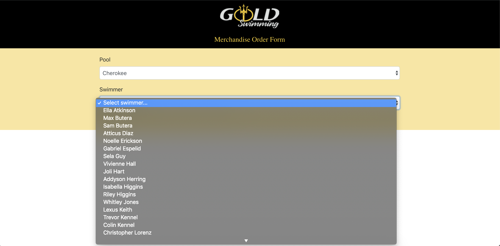
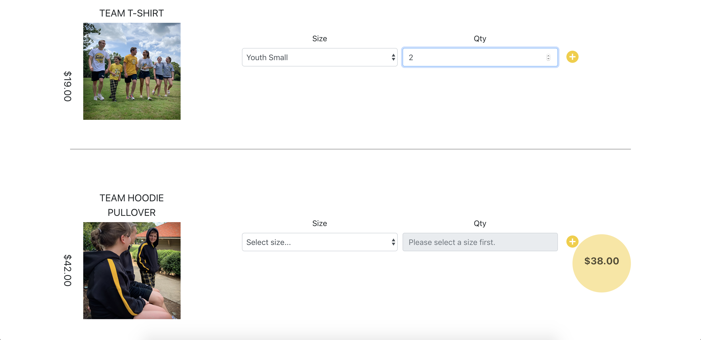
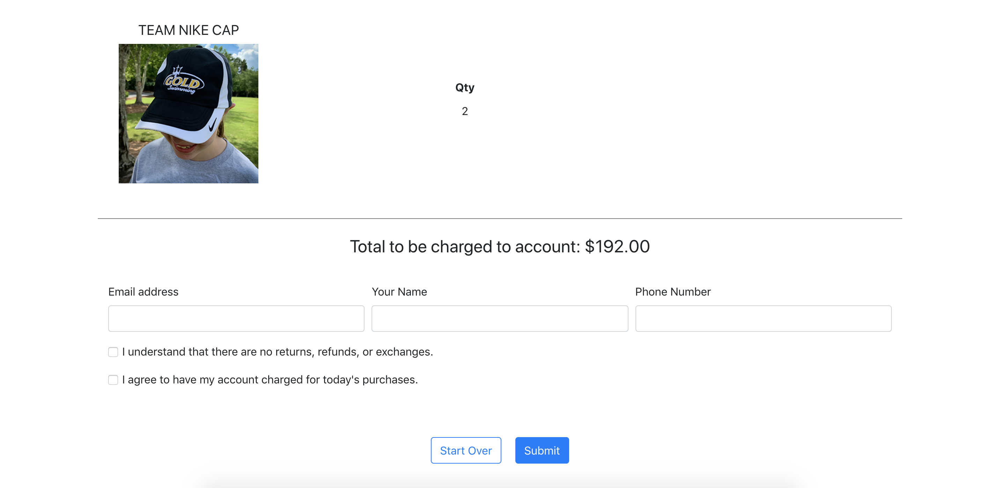
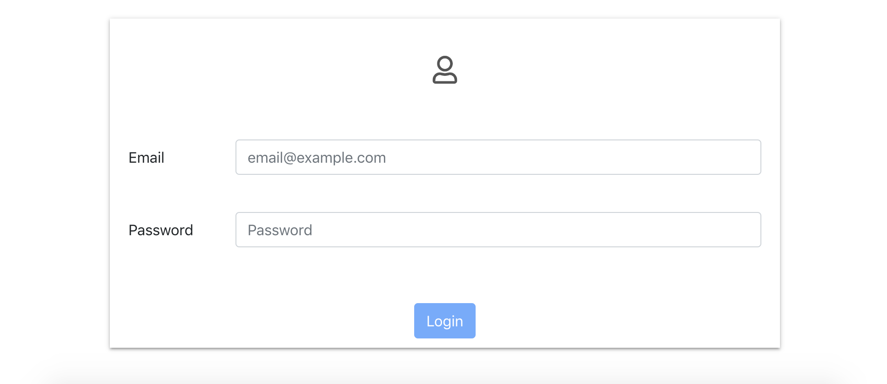
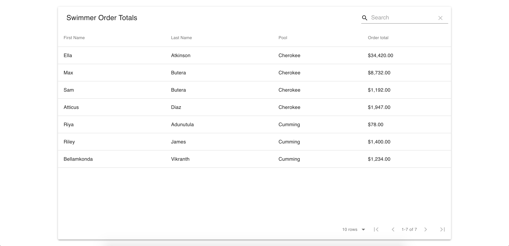

## SwimOrders
A merchandise ordering website for our local swim club (~700 swimmers).

## GitHub Link
[SwimOrders GitHub](https://www.github.com/eddieatkinson/swimOrders)

## Live Site
[SwimOrders](https://goldswim.eddiebatkinson.com)

## Technologies used:
**Languages**
* JavaScript
* CSS

**Frameworks**
* React

**Other:**
* Redux (state management)
* Express (Node on the back end)
* MySQL database

## Code Snippets
Login access:
``` javascript
detectKeys(event) {
    const newKeystrokes = this.state.keystrokes + event.key;
    this.setState({
      keystrokes: newKeystrokes,
    });
    const name = secretName;
    if (this.state.keystrokes.toLowerCase().includes(name)) {
      this.setState({
        keystrokes: '',
        showLogin: true,
      });
    }
  }

  componentDidMount(){
    document.addEventListener("keydown", this.detectKeys.bind(this));
  }

  componentWillUnmount(){
    document.removeEventListener("keydown", this.detectKeys.bind(this));
  }
  ```
  Responsive:
  ``` css
  .wrapper {
  margin: auto;
  width: 80%;
}

.too-late {
  margin: 100px auto;
  display: block;
}

@media only screen and (max-width: 1223px) {
  .wrapper {
    width: 90%;
  }
  .too-late {
    margin: 20px auto;
  }
}
```
Get conditional sizes for dropdown:
``` javascript
  const getSizes = () => {
    const sizesArrayCopy = [...props.sizes];
    const lastElement = sizesArrayCopy.pop();
    if (props.item.id === 3) {
      sizesArrayCopy.splice(3, 0, lastElement);
    }
    const options = map(sizesArrayCopy, (size, i) => {
      if (!!props.item.onlyAdult) {
        if (i > 2) {
          return (
            <option value={size.id} key={size.id}>{size.name}</option>
          );
        }
      } else {
        return (
          <option value={size.id} key={size.id}>{size.name}</option>
        );
      }
    });
    return options;
  }
```
Submitting order on server:
``` javascript
router.post('/submitorder', (req, res) => {
  const { swimmerId, email, name, phone, swimmerName, order, poolName, groupName, swimmerSize, price } = req.body;
  const insertOrder = `INSERT INTO orders (swimmerId, itemId, sizeId, qty, email, phone, parentName, color, special)
    VALUES
    (?,?,?,?,?,?,?,?,?);`;
  lodash.forEach(order, (order) => {
    connection.query(insertOrder, [swimmerId, order.order.id, order.order.size, order.order.qty, email, phone, name, order.color, order.special], (error) => {
      if(error) {
        throw error;
      }
    });
  });
  const ejsObjectAdmin = {
    name,
    swimmerName,
    swimmerSize,
    email,
    poolName,
    groupName,
    phone,
    order,
    price,
  }
  ejs.renderFile(__dirname + '/adminEmail.ejs', ejsObjectAdmin, (err, data) => {
    if (err) {
      console.log(err);
    } else {
      const mailToAdmin = {
        from: 'New Order',
        to: mail.user,
        subject: `New Order for ${poolName} Pool`,
        html: data,
      };
      transporter.sendMail(mailToAdmin, (err2) => {
        if (err2) {
          res.json({
            msg: 'mailToAdminFail',
          });
        } else {
          const ejsObjectParent = {
            poolName,
            groupName,
            order,
            price,
          }
          ejs.renderFile(__dirname + '/parentEmail.ejs', ejsObjectParent, (err3, data2) => {
            if (err3) {
              console.log(err3);
            } else {
              const mailToParent = {
                from: 'Gold Swim Merchandise',
                to: email,
                subject: `Your Gold Swim Order for ${swimmerName}!`,
                html: data2,
              };
              transporter.sendMail(mailToParent, (err4) => {
                if (err4) {
                  res.json({
                    msg: 'mailToParentFail',
                  });
                } else {
                  res.json({
                    msg: 'orderSuccess',
                  });
                }
              })
            }
          })
        }
      })
    }
  });
});
```
## Screenshots
Choosing swimmer:

Ordering items:

Confirmation page:

Login for administrator:

Ordering data:

